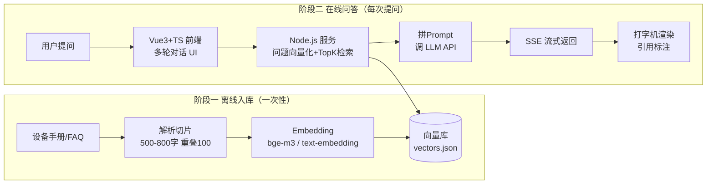

# 园区设备知识库问答（RAG Demo）

一个可直接运行的个人项目：把**园区设备运维手册/FAQ**入库，用自然语言提问，系统检索相关知识片段，由大模型生成**带引用来源**的**流式（打字机）回答**。

技术栈：**Vue3 + Vite + TypeScript**（前端） · **Node.js + Express 风格零依赖服务**（后端，内置 HTTP 服务） · **SSE 流式** · RAG（Embedding 向量检索 + Prompt 拼接）。

> 本项目是简历中「园区设备知识库问答助手」AI 应用条目的实操证据。跑通后即可写进简历、录演示视频、回答面试追问。

---

## 一、系统架构



| 环节 | 实现 |
|---|---|
| 知识入库 | `server/src/ingest.js`：读 `server/data/source/*.md` → 按段落切片（500-800字、重叠100）→ 向量化 → 写 `vectors.json` |
| 向量检索 | `server/src/vector-store.js`：余弦相似度 TopK（默认5条，阈值0.1） |
| 提示词组装 | `server/src/rag.js`：知识上下文 + 多轮历史裁剪（默认4000字符） |
| 流式回答 | `server/src/llm.js`：OpenAI 兼容 `/chat/completions` stream → SSE 转发 |
| 前端渲染 | `web/src/api.ts` 解析 SSE → 打字机效果 + 参考来源折叠卡片 |

---

## 二、快速开始

前置要求：Node.js ≥ 18（推荐 20+）。

```bash
# 1. 安装依赖（仅前端需要；后端零依赖）
npm install

# 2. 配置 API Key（可选，不配置则自动进入 MOCK 离线演示模式）
cp .env.example .env
#    编辑 .env：填 LLM_API_KEY / EMBEDDING_API_KEY

# 3. 知识入库（首次必做；不配置 Key 时用 mock 也能跑通链路）
npm run ingest          # 真实模式（需要 EMBEDDING_API_KEY）
# 或 npm run ingest:mock  # 离线模式

# 4. 启动
npm run dev:server      # 终端1：后端 http://localhost:3001
npm run dev:web         # 终端2：前端 http://localhost:5173
```

浏览器打开 **http://localhost:5173** 即可对话。

> **MOCK 模式**：`.env` 未配置 `LLM_API_KEY` 时服务自动进入 MOCK（或手动设 `MOCK_MODE=true`）。此时向量是哈希伪向量、回答是固定演示文案——**不花一分钱**就能验证「入库→检索→SSE→前端渲染」全链路。配好 Key 重启即切换真实模式。

---

## 三、API Key 配置说明

对话模型与向量模型是**两家服务**（DeepSeek 没有向量接口），按下面组合任选：

| 用途 | 推荐 | 配置示例 |
|---|---|---|
| 对话生成 | DeepSeek（便宜） | `LLM_BASE_URL=https://api.deepseek.com/v1` `LLM_MODEL=deepseek-chat` |
| 对话生成 | 通义千问 | `LLM_BASE_URL=https://dashscope.aliyuncs.com/compatible-mode/v1` `LLM_MODEL=qwen-plus` |
| 向量化 | SiliconFlow bge-m3（中文好） | `EMBEDDING_PROVIDER=siliconflow` `EMBEDDING_MODEL=BAAI/bge-m3` |
| 向量化 | 通义百炼 text-embedding-v3 | `EMBEDDING_PROVIDER=dashscope` `EMBEDDING_MODEL=text-embedding-v3` |
| 向量化 | OpenAI | `EMBEDDING_PROVIDER=openai` `EMBEDDING_MODEL=text-embedding-3-small` |

申请地址：DeepSeek open平台、阿里云百炼、SiliconFlow 硅基流动、OpenAI Platform。按演示级用量估算，成本约 10 元内。

---

## 四、接口说明（SSE）

```
POST /api/chat?top_k=5
Content-Type: application/json

{ "messages": [ { "role": "user", "content": "电梯困人了怎么处置？" } ] }
```

响应为 SSE 流，事件协议：

| 事件 | 数据 | 说明 |
|---|---|---|
| `delta` | `{"content":"..."}` | 回答增量（打字机） |
| `sources` | `{"sources":[{source,text,score}],"total":N}` | 引用来源与知识库总量 |
| `done` | `{"usage":null}` | 结束 |
| `error` | `{"message":"..."}` | 错误信息 |

`GET /health` 返回服务状态、是否 MOCK、知识库条数。

---

## 五、替换成你的真实知识库

1. 把你的设备手册 / 故障FAQ（`.md` 或 `.txt`）放进 `server/data/source/`（可以多份文件，自动合并入库）；
2. 重新入库：`npm run ingest`；
3. 重启后端即可。

> 当前 `server/data/source/` 里是示例手册（中央空调/电梯/消防/门禁/监控/配电/给排水等），入库后即可体验。

---

## 六、目录结构

```
park-kb-qa-demo/
├── .env.example          # 环境变量模板（复制为 .env）
├── package.json          # 根：一键脚本 + npm workspaces
├── README.md
├── server/               # 后端（零 npm 依赖，Node >= 18）
│   ├── package.json
│   ├── src/
│   │   ├── config.js     # .env 加载 + 配置
│   │   ├── embed.js      # 向量化（SiliconFlow/DashScope/OpenAI + MOCK）
│   │   ├── llm.js        # LLM 流式调用（DeepSeek/通义/OpenAI + MOCK）
│   │   ├── vector-store.js  # 余弦相似度 TopK + JSON 持久化
│   │   ├── rag.js        # 检索 → 拼 Prompt → 生成
│   │   ├── ingest.js     # 知识入库脚本
│   │   └── index.js      # HTTP 服务（SSE）
│   └── data/
│       ├── source/       # 知识库原始文档（.md/.txt）
│       └── vectors.json  # 入库产物（已 gitignore）
└── web/                  # 前端 Vue3 + Vite + TS
    ├── package.json
    ├── vite.config.ts    # /api 代理 → localhost:3001
    ├── index.html
    └── src/
        ├── main.ts
        ├── App.vue       # 对话页（流式渲染 + 引用来源 + 停止按钮）
        ├── api.ts        # SSE 客户端解析
        └── style.css
```

---

## 七、面试追问点（跑通后重点准备）

- **为什么切片 500-800 字、重叠 100 字？** —— 兼顾召回粒度与上下文完整性，重叠避免跨段信息被切断；可讲你实测对比。
- **TopK 怎么定、相似度阈值怎么调？** —— TopK 大召回全但噪音多，小则易漏；阈值过滤无关片段，可用示例问题实测调参。
- **SSE 断线/中断怎么处理？** —— 前端 AbortController 停止、服务端按事件协议输出；生产可用心跳与断线重连。
- **多轮对话的 Token 控制？** —— 历史按字符预算裁剪 + 系统提示词固定，防止上下文爆炸。
- **成本怎么控？** —— 只对检索命中的片段进 Prompt、历史裁剪、演示级用量约 10 元。

## 八、下一步（第 2 周打磨）

- [x] 引用来源可点击跳转原文（`GET /api/source` + 弹窗高亮定位）
- [x] 断线重连：服务端 15s 心跳 + 前端中断检测与"点击重试"
- [ ] 向量库换 Chroma / sqlite-vec 支持更大知识库
- [ ] README 补效果截图 + 录 2-3 分钟演示视频
